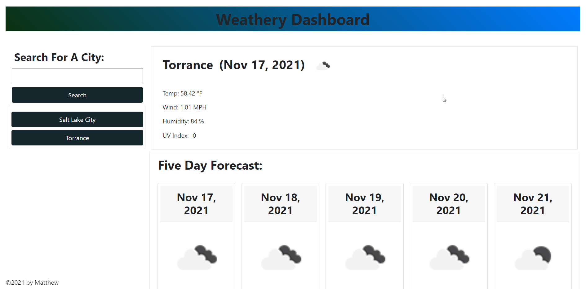

  # Weathery
  https://stormblessed624.github.io/weathery/

  ## Description
  This is an app that pulls weather information for the current week in whatever city selected.

  ## Table of Contents
  * [Usage](#usage)
  * [Contributing](#contributing)
  

  ## Usage
  For quickly checking what the weather is like.
  

  ## Contributing
  Stormblessed624
  

  ## Questions?
  - Reach me at my email: matt.white.624@gmail.com
  - GitHub username: [Stormblessed624](https://github.com/Stormblessed624/)

  

